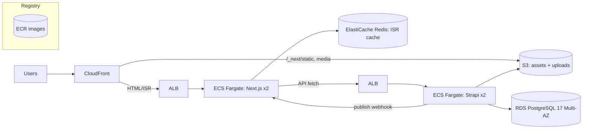

# VNG Platform — Architecture & Implementation Plan

**Deliverable:** Plan only (no full application code).
**Stack:** Strapi 5 (Community, headless) + Next.js 16 (App Router / RSC / React 19), pnpm 10 workspaces, Turborepo (remote cache), Biome, Lefthook, Docker, AWS.
**Reference starter:** [notum-cz/strapi-next-monorepo-starter](https://github.com/notum-cz/strapi-next-monorepo-starter) — adapt heavily; single required deviation = **Biome replaces ESLint + Prettier**.
**Business context:** VNG Website Revamp (`vng.com.vn`) — CMS-driven corporate site, VI/EN, thousands of articles, first-class SEO/AIO, admin autonomy, hard launch window (soft launch ~20/09/2026). See [master_summary.md](docs/master_summary.md) and [website-req_details.md](docs/website-req_details.md).

---

## 0. Assumptions (explicit)

| # | Assumption | Rationale |
|---|---|---|
| A1 | Single AWS region (`ap-southeast-1`, Singapore) for prod; CloudFront global edge. | Audience is VN; nearest region + CDN edge covers latency. |
| A2 | Multi-instance from day one (≥2 tasks per app for HA). → shared cache handler is **mandatory**, not optional. | Corporate site needs HA; the prompt flags multi-instance cache consistency. |
| A3 | SSO/MFA for CMS via VNG IdP (SAML/OIDC) is required but can land in Phase 4; day-one uses Strapi local auth + admin SSO plugin stub. | Req §8 asks SSO/MFA; not launch-blocking for content editors on a locked-down admin. |
| A4 | "Immediate" freshness = webhook-driven `revalidateTag` (typ. < 2s p95), safety-net time-based revalidation. | Matches hard requirement; no rebuild/redeploy for content. |
| A5 | Editorial workflow (Draft→Review→Approved→Published→Archived) uses Strapi **Review Workflows** — an Enterprise feature. On Community we implement it via a `contentStatus` enum + custom transition service + RBAC. | Req §3 is Must-have; CE has no native review workflows. See §4.5. |
| A6 | Media stored on S3; virus scanning via an upload-lifecycle hook → Lambda (ClamAV) is a Phase 3 item. | Req §2 requires upload scanning; not launch-blocking. |
| A7 | IR page, Career, DMF, BU sites remain **embedded/linked externally** — we do not re-platform them. | Explicit in requirements (embed/link groups). |

---

## 1. Key Architecture Decisions & Trade-offs

| Decision | Choice | Why (trade-off) |
|---|---|---|
| Monorepo topology | pnpm workspaces + Turborepo, apps + packages | Shared types/design-system without publishing; Turbo affected-graph drives CI + remote cache. Cost: tuned `turbo.json` inputs/outputs. |
| Frontend rendering | RSC-first, **ISR + on-demand tag revalidation**; SSG only for a tiny static shell set | Thousands of articles ⇒ full SSG forbidden (build explosion). ISR gives static-fast + instant freshness. Cost: needs Node runtime + shared cache. |
| Cache consistency across instances | **Custom Next.js `cacheHandler` backed by Redis (ElastiCache)** | Default filesystem cache is per-instance; a `revalidateTag` on instance A wouldn't clear B. Redis makes revalidation cluster-wide. Cost: one more managed service. |
| Freshness mechanism | Strapi lifecycle → signed webhook → Next Route Handler → `revalidateTag()`/`revalidatePath()` | Single-entry invalidation, zero rebuild. Safety-net `cacheLife`/time-based revalidate for missed webhooks. |
| Content ↔ Code split | **Content change = revalidate (no deploy). Code change = CI/CD build + deploy.** | Enforced operationally + in docs; the two paths never cross. |
| CMS | Strapi 5 CE, built-ins first (dynamic zones, i18n, D&P, RBAC, media, scheduled publish, S3 provider) | Admin autonomy + lowest custom surface. Gaps (review workflow, audit, redirects) filled by config → custom code → plugin ladder (§4.6). |
| Page builder | Typed **dynamic zones** of reusable components; shared TS types generated from Strapi schema | Non-technical users compose pages from blocks; FE renders a typed block-registry. |
| UI base | **shadcn/ui + Tailwind v4 + Radix** PRIMARY; **Astryx** = documented fallback/2027 exploration | Production + fixed deadline + security review ⇒ beta risk unacceptable. shadcn = own-the-source, lowest risk, matches starter. See §2. |
| DB | RDS PostgreSQL 17 (Multi-AZ prod) | Hard constraint; Multi-AZ for HA. |
| Compute | **Next.js → ECS Fargate** (needs long-lived Node for ISR + custom cache handler); **Strapi → ECS Fargate** | App Runner is simpler but weaker on VPC/EFS/Redis wiring, blue-green, and admin cost control. Fargate gives one consistent, controllable model for both. See §8. |
| i18n | **next-intl** (FE) mirrored to Strapi i18n (content) | App Router-native; VI/EN independent per Req §7. |
| Language | TypeScript everywhere, strict; Zod for runtime validation shared FE↔forms | Type safety end-to-end; one schema source. |

**Deliberately rejected:** full SSG (build explosion); Vercel hosting (AWS is a hard constraint + cost/control); running two component systems (prompt forbids); ESLint/Prettier (Biome mandated).

---

## 2. UI Base Recommendation

### Recommendation: **shadcn/ui + Tailwind CSS v4 + Radix** (PRIMARY). Fallback: **Astryx**.

| Criterion | shadcn/ui (chosen) | Astryx (fallback) |
|---|---|---|
| Maturity | Stable, massive ecosystem | **Beta** — unacceptable for a fixed-date production corporate launch |
| Ownership | You own the copied source → full control, easy audit for security review | Package dependency; less direct control |
| Learning curve | Tailwind — team-familiar | StyleX — steeper, slows a tight timeline |
| Theming / dark + multi-theme | CSS variables + `next-themes`; solid-minimalism tokens easy | Strong token theming + built-in themes (its best feature) |
| AI-agent ergonomics | Good via components.json + docs/skills we author | **Native CLI + MCP** (its differentiator) |
| Reference-starter fit | Direct match | Deviation |
| Risk | **Lowest** | Beta + peer-dep churn |

**Verdict:** The decisive factors here are *fixed launch date + mandatory security review*. shadcn/ui's "own the source, lowest risk" wins. Astryx's AI/MCP + multi-theme edge is real but not worth beta risk on this timeline — we capture the AI-agent ergonomics ourselves via `.claude/skills` and a typed block registry (§7). Re-evaluate Astryx post-launch (2027 multi-site phase) when its beta matures.

### Final companion stack (one per role)

| Role | Library | Version (pin) | Notes |
|---|---|---|---|
| Components | shadcn/ui (Radix primitives) | Radix `^1.x` latest | Copied into `packages/design-system` |
| Styling | Tailwind CSS | `^4.x` | v4 engine, CSS-first config |
| Animation | Motion | `^12.x` | `whileInView`; respect `prefers-reduced-motion` |
| i18n | next-intl | `^4.x` | App Router |
| Forms + validation | React Hook Form + Zod | RHF `^7.x`, Zod `^3.x` | Zod schemas shared FE↔content validation |
| Icons | lucide-react | latest | Tree-shakable |
| Data tables (admin views) | TanStack Table | `^8.x` | Only where needed |
| Strapi block rendering | blocks-react-renderer | latest | Rich-text/dynamic-zone blocks |
| Toasts / cmd / carousel / drawer | sonner / cmdk / embla / vaul | latest | Add only when a block needs them |
| Theme toggle | next-themes | `^0.4.x` | shadcn path only |

Visual direction: **solid minimalism** — high-contrast, spacious, confident; tokenized color/spacing/typography scale; light/dark + theme variants; VI/EN; subtle, lightweight, reduced-motion-aware animation.

---

## 3. Monorepo Folder Structure

```text
vng-platform/
├─ apps/
│  ├─ web/                      # Next.js 16 (App Router, RSC, React 19)
│  │  ├─ app/
│  │  │  ├─ [locale]/           # next-intl segment (vi | en)
│  │  │  │  ├─ (marketing)/     # static shell: home, about, legal
│  │  │  │  ├─ tin-tuc/         # article list + [slug] (ISR, tagged)
│  │  │  │  ├─ [...slug]/       # dynamic landing pages (page builder)
│  │  │  │  └─ category/[slug]/
│  │  │  ├─ api/
│  │  │  │  └─ revalidate/route.ts   # webhook receiver → revalidateTag
│  │  │  ├─ sitemap.ts          # dynamic sitemap
│  │  │  ├─ robots.ts
│  │  │  └─ manifest.ts
│  │  ├─ cache-handler.mjs      # custom Redis cache handler (ISR consistency)
│  │  ├─ next.config.ts
│  │  └─ Dockerfile
│  └─ cms/                      # Strapi 5 (Community)
│     ├─ src/
│     │  ├─ api/                # content types (article, landing-page, ...)
│     │  ├─ components/         # reusable page-builder blocks (shared/*, seo)
│     │  ├─ extensions/         # core overrides
│     │  ├─ plugins/            # custom plugins (workflow, audit) if needed
│     │  └─ index.ts            # bootstrap: register lifecycle→webhook
│     ├─ config/                # database, server, admin, plugins (S3, i18n)
│     └─ Dockerfile
├─ packages/
│  ├─ design-system/            # shadcn components, tokens, theme provider
│  ├─ shared/                   # generated Strapi TS types + typed API client + Zod schemas + cache-tag helpers
│  ├─ config-biome/             # biome.json preset
│  └─ config-tsconfig/          # base tsconfig presets
├─ qa/                          # Playwright e2e + Lighthouse CI
├─ docs/                        # Docusaurus: ADRs + task recipes
├─ .agents/                     # agent working notes / worktrees conventions
├─ .claude/
│  └─ skills/                   # add-content-type, add-block, add-theme, add-language, wire-webhook
├─ scripts/                     # seed, generate-types, migrate
├─ .github/workflows/           # ci.yml (change-detection), deploy-*.yml
├─ pnpm-workspace.yaml
├─ turbo.json
├─ biome.json
├─ lefthook.yml
├─ commitlint.config.ts
├─ .nvmrc                       # 24
├─ docker-compose.yml           # local: postgres17, redis, cms, web
└─ AGENTS.md  CLAUDE.md  README.md
```

---

## 4. Strapi Content Model + Page-Builder + Plugin/Custom-Code Strategy

### 4.1 Core content types

| Type | Key | i18n | D&P | Purpose |
|---|---|---|---|---|
| Article | `article` | ✓ | ✓ | Blog/news detail; rich body + SEO + taxonomy |
| Landing Page | `landing-page` | ✓ | ✓ | Fully block-composed page (dynamic zone) |
| Page (static shell) | `page` | ✓ | ✓ | About/legal/marketing — rarely-changing |
| Category | `category` | ✓ | – | News taxonomy |
| Tag | `tag` | ✓ | – | Cross-cutting labels |
| Author | `author` | – | – | Byline + JSON-LD `author` |
| Redirect | `redirect` | – | – | 301 map (from→to, permanent) — Req §6, 297 legacy 404s |
| Navigation | `navigation` | ✓ | ✓ | Multi-level header/footer menu (Req §7) |
| Global | `global` (single) | ✓ | – | Site name, default SEO, social, org schema |

### 4.2 Page-builder dynamic zone (`blocks`) — initial block library

`hero`, `rich-text`, `media`, `image-gallery`, `cta`, `feature-grid`, `stats/key-numbers`, `logo-cloud`, `timeline` (history), `leadership-grid`, `faq` (→ FAQPage schema), `testimonial`, `embed` (IR/BU/DMF iframe), `article-carousel` (auto-pull latest N), `newsletter/contact-form`.

Each block = a reusable Strapi **component**. FE renders via a typed **block registry** (`blockType → React component`). Adding a block = Strapi component + registry entry + Zod schema (recipe in §7).

### 4.3 Shared SEO component (attached to Article/Landing/Page)

`metaTitle`, `metaDescription`, `canonicalURL`, `ogImage` (media), `noindex` (bool), `structuredData` (json), `keywords`. See §6.

### 4.4 Smart population strategy

- Central population config in `packages/shared` — one source of truth per content type (avoids over-fetching + N+1).
- Deep-populate dynamic zones per-component (`on` populate for polymorphic blocks); shallow-populate lists.
- List endpoints return **cards only** (title, slug, cover, excerpt, publishedAt); detail endpoints deep-populate. Keeps list payloads small for Lighthouse.
- Generated TS types (`strapi-plugin` type generation or `openapi`→types) consumed by the typed API client.

### 4.5 Editorial workflow on Community edition

Strapi Review Workflows are Enterprise. On CE:
- `contentStatus` enum: `draft | review | approved | published | archived`.
- Custom **transition service** enforces legal transitions + records who/when/reason in an `EditorialLog`.
- RBAC roles map to allowed transitions: Contributor(→review), Editor(→review/approve), Approver(→approved/reject+comment), Publisher(→published/archived). Aligns Req §3/§4 roles (Master Admin, Admin, Editor, Contributor, Viewer).
- Native **Draft & Publish** still backs the actual published/unpublished state + **scheduled publishing**.

### 4.6 Build-a-plugin vs inline custom code — rule of thumb

| Situation | Do |
|---|---|
| Behavior tied to one content type; no admin UI; no reuse | **Inline** controller/service/route or lifecycle hook |
| Pure config (S3, i18n locales, RBAC, webhooks) | **Config** |
| Reusable across content types, needs admin UI, settings, or its own DB tables, or you'd ship it to other projects | **Custom plugin** |

Applying the rule:
- Webhook-on-publish → **lifecycle hook** (inline).
- Redirects → **content type + custom middleware** (inline) that resolves 301s.
- Editorial workflow + audit log → **custom plugin** (cross-type, admin UI, own tables, audit immutability). Matches Req §3/§5.
- Sitemap → **inline** route/controller (or FE-generated; we do FE — §6).

---

## 5. Rendering & Content-Sync Design

### 5.1 Page classes → strategy

| Page class | Strategy | Revalidation |
|---|---|---|
| Static shell (home shell, /about, legal, rare marketing) | Prerender, long `cacheLife` | Time-based (hours) + manual |
| Article detail `/tin-tuc/[slug]` | ISR, SWR | Tag `article:{id}` + `list:articles` |
| Article list / category / tag | ISR, SWR | Tag `list:articles`, `category:{slug}` |
| Dynamic landing `/[...slug]` | ISR, SWR | Tag `landing:{slug}` |
| Auto-pull sections (latest news on home) | Cached fetch tagged `list:articles` | Invalidated when any article publishes |

### 5.2 Cache-tag scheme

| Entity event | Tags invalidated |
|---|---|
| Article publish/update/unpublish | `article:{id}`, `list:articles`, `category:{catSlug}`, any `tag:{tagSlug}` |
| Landing page change | `landing:{slug}` (+ `list:landings` if listed) |
| Navigation change | `navigation:{locale}` (global layout) |
| Global/SEO defaults | `global` |

Fetches tagged with `next: { tags: [...] }` (or `use cache` + `cacheTag`/`cacheLife` model). `cacheLife` profiles: `static` (1d+), `content` (1h SWR), `list` (10m SWR).

### 5.3 Freshness flow (concrete)

```mermaid
sequenceDiagram
  participant Editor
  participant Strapi
  participant Next as Next /api/revalidate
  participant Redis as Redis cacheHandler
  participant CDN as CloudFront
  Editor->>Strapi: Publish / Update / Unpublish
  Strapi->>Strapi: lifecycle afterUpdate/afterCreate
  Strapi->>Next: POST {model,id,slug,locale} + HMAC signature
  Next->>Next: verify signature; map entry→tags
  Next->>Redis: revalidateTag(article:123, list:articles)
  Note over Next,Redis: cluster-wide invalidation (all instances)
  Editor->>CDN: next request → MISS → regenerate → fresh
```

- **Route Handler** `/api/revalidate`: verifies HMAC (shared secret), maps `{model,id,slug}`→tags, calls `revalidateTag`/`revalidatePath`, returns 200. Idempotent; logs.
- **Multi-instance consistency:** custom `cache-handler.mjs` (e.g. `@neshca/cache-handler` pattern) backed by **ElastiCache Redis**, wired via `next.config.ts` `cacheHandler`. Without it, revalidation only clears the instance that received the webhook.
- **Safety net:** every content page also carries a time-based revalidate (e.g. 1h) so a missed webhook self-heals.
- **CloudFront:** caches HTML with short TTL + `stale-while-revalidate`; honors origin cache headers. On revalidate, next request repopulates. (Optional CloudFront invalidation only for static shell.)

### 5.4 Content vs Code (restated)

- **Content change** → webhook → `revalidateTag` → **instant, no build, no deploy.**
- **Code change** → CI/CD → build affected app(s) → deploy. Never a content operation.

---

## 6. Design System / Theming / i18n / SEO / Performance

### 6.1 Design system & theming
- `packages/design-system`: shadcn components + design tokens as CSS variables (color/spacing/type scale). Themes = token sets; `next-themes` toggles light/dark + named themes. Solid-minimalism defaults.

### 6.2 i18n
- `next-intl` with `[locale]` routing (vi/en); messages in repo. Content locale mirrors Strapi i18n. Independent VI/EN slugs, titles, SEO (Req §7). `hreflang` alternates emitted per page.

### 6.3 SEO (first-class)

| SEO artifact | Modeled in Strapi | Rendered in Next |
|---|---|---|
| Title/description/OG/canonical | SEO component per entry | `generateMetadata()` (Metadata API) |
| JSON-LD (Organization, NewsArticle, Breadcrumb, FAQPage) | `structuredData` field + block-derived | `<script type="application/ld+json">` in RSC |
| sitemap.xml | published entries | `app/sitemap.ts` (dynamic, canonical-only) |
| robots.txt | `noindex` flags + rules | `app/robots.ts` |
| hreflang | i18n locale links | metadata `alternates.languages` |
| 301 redirects | `redirect` content type | middleware / `redirects()` |
| draft/preview | Strapi Draft & Publish + preview token | Next **draft mode** route |
| scheduled publish | Strapi scheduled publishing | webhook fires at publish time |

Covers the SEO/AIO backlog from [master_summary.md](docs/master_summary.md) §5 (noindex cleanup, canonical www/non-www, 404→301 map, hreflang, Org/Breadcrumb/FAQ/NewsArticle schema, dynamic sitemap, CWV).

### 6.4 Performance (Lighthouse 95–100)
- RSC-first; `'use client'` only for interactive islands (carousels, forms, theme toggle, menus).
- `next/image` → WebP/AVIF, responsive sizes, priority for LCP; media served from S3 via CloudFront.
- Streaming + Suspense for below-the-fold blocks; skeletons.
- `next/font` self-hosted, `display: swap`, preloaded subset (VI diacritics).
- ISR + tag caching ⇒ dynamic pages serve as static from edge → high cache-hit ratio.
- Minimal JS: tree-shakable libs, no client date/heavy libs in RSC; Motion loaded per-island.
- **Lighthouse CI** gate in `qa/` (budget: LCP < 2.5s, INP < 200ms, CLS < 0.1) blocks regressions.

---

## 7. AI / Agent Enablement (files + purpose)

| File / dir | Purpose | Location |
|---|---|---|
| `AGENTS.md` | Root map: stack, commands, conventions, "content vs code" rule, do/don't | repo root |
| `CLAUDE.md` | Claude-specific: build/test/lint commands, package boundaries, safety notes | repo root |
| `apps/web/CLAUDE.md` | FE agent notes: routing, cache tags, where to add pages/blocks | apps/web |
| `apps/cms/CLAUDE.md` | CMS agent notes: content-type/component/lifecycle conventions | apps/cms |
| `.claude/skills/add-content-type/` | Recipe: scaffold content type + types + population + tags | .claude/skills |
| `.claude/skills/add-page-builder-block/` | Recipe: Strapi component + FE registry entry + Zod | .claude/skills |
| `.claude/skills/add-theme/` | Recipe: token set + next-themes wiring | .claude/skills |
| `.claude/skills/add-language/` | Recipe: next-intl locale + Strapi locale + hreflang | .claude/skills |
| `.claude/skills/wire-revalidation-webhook/` | Recipe: lifecycle hook + tag mapping + Route Handler | .claude/skills |
| `skills-lock.json` | Pins skill versions for reproducibility | repo root |
| `docs/` (Docusaurus) | ADRs + the recipes above as human docs | docs/ |

ADRs to seed: ADR-001 rendering strategy (ISR+tags), ADR-002 UI base (shadcn), ADR-003 cache handler (Redis), ADR-004 workflow on CE, ADR-005 monorepo/CI change-detection.
*Astryx note:* if adopted later, its MCP server + CLI register under `.claude/` and agents call it for component generation — deferred with the Astryx decision.

---

## 8. AWS Deployment Topology + CI/CD Change-Detection

### 8.1 Topology



| Concern | Choice |
|---|---|
| Compute | ECS Fargate for both (Node runtime for ISR; consistent VPC/Redis/blue-green control) |
| CDN | CloudFront in front of Next (HTML/ISR) + S3 (static + media) |
| DB | RDS PostgreSQL 17, Multi-AZ (prod), automated backups + PITR |
| ISR cache | ElastiCache Redis (shared cache handler) |
| Media | S3 (Strapi upload provider) + CloudFront |
| Secrets | AWS Secrets Manager (DB creds, webhook HMAC, S3 keys) injected as ECS task secrets |
| Registry | ECR |
| IaC | Terraform (recommended) — envs as workspaces |
| Envs | dev / staging / prod (separate accounts or VPCs) |

### 8.2 Migrations & rollback
- **Strapi DB migrations** run as a one-off ECS task (or entrypoint step) *before* new task set takes traffic; forward-only; back up (snapshot) pre-deploy.
- **Rollback:** ECS keeps prior task-def revision → roll back image instantly; DB via snapshot/PITR if a migration is bad (hence forward-only, additive migrations preferred). Blue-green via ECS deployment / CodeDeploy for zero-downtime.

### 8.3 CI/CD change-detection (concrete)

Turborepo affected-graph + GitHub Actions path filters decide FE-only / BE-only / both.

```yaml
# .github/workflows/ci.yml  (illustrative)
name: CI
on:
  push: { branches: [main] }
  pull_request:

jobs:
  detect:
    runs-on: ubuntu-latest
    outputs:
      web: ${{ steps.filter.outputs.web }}
      cms: ${{ steps.filter.outputs.cms }}
    steps:
      - uses: actions/checkout@v4
        with: { fetch-depth: 0 }
      - uses: dorny/paths-filter@v3
        id: filter
        with:
          filters: |
            web:
              - 'apps/web/**'
              - 'packages/**'
            cms:
              - 'apps/cms/**'
              - 'packages/**'

  quality:
    runs-on: ubuntu-latest
    steps:
      - uses: actions/checkout@v4
      - uses: pnpm/action-setup@v4
      - uses: actions/setup-node@v4
        with: { node-version: 24, cache: pnpm }
      - run: pnpm install --frozen-lockfile
      # Turbo remote cache: only affected tasks actually run
      - run: pnpm turbo run lint typecheck test build --filter='...[origin/main]'
        env:
          TURBO_TOKEN: ${{ secrets.TURBO_TOKEN }}
          TURBO_TEAM: ${{ secrets.TURBO_TEAM }}

  deploy-web:
    needs: [detect, quality]
    if: needs.detect.outputs.web == 'true' && github.ref == 'refs/heads/main'
    uses: ./.github/workflows/deploy-app.yml
    with: { app: web }
    secrets: inherit

  deploy-cms:
    needs: [detect, quality]
    if: needs.detect.outputs.cms == 'true' && github.ref == 'refs/heads/main'
    uses: ./.github/workflows/deploy-app.yml
    with: { app: cms }   # deploy-app.yml: build+push ECR → run migrations (cms) → ECS deploy → health check
    secrets: inherit
```

- `packages/**` touches force **both** (shared types/design-system).
- `deploy-app.yml` (reusable): build Docker → push ECR → (cms only) run migration task → `aws ecs update-service` (blue-green) → health check → auto-rollback on failure.
- **Content vs code restated in pipeline:** the pipeline builds/deploys **code**. Content publishing bypasses CI entirely — webhook → `revalidateTag`, no build.

---

## 9. Phased Roadmap (with Definition of Done)

| Phase | Milestone | Definition of Done |
|---|---|---|
| **P0 — Foundation** (wk 1) | Monorepo skeleton | pnpm workspaces + Turbo + Biome + Lefthook + commitlint + `.nvmrc` 24; `docker-compose` (pg17+redis+cms+web) boots; CI runs lint/typecheck/build on affected. |
| **P1 — CMS core** (wk 1–2) | Content model + page builder | Content types + block components + SEO component defined; i18n (vi/en) + Draft&Publish + scheduled publish on; S3 upload provider; generated TS types consumed by `packages/shared`; seed data. |
| **P2 — FE rendering** (wk 2–3) | ISR + typed client + block registry | Article list/detail, dynamic landing, category/tag render from CMS; typed API client + smart population; block registry renders all P1 blocks; static shell prerendered. |
| **P3 — Freshness** (wk 3) | Webhook → revalidate, cluster-wide | Publish in CMS reflects on FE < 2s without rebuild; Redis cache handler verified across 2 instances; HMAC-verified Route Handler; safety-net revalidate; cache-tag scheme documented. |
| **P4 — SEO/AIO + workflow + audit** (wk 3–4) | First-class SEO + editorial | Metadata API, JSON-LD (Org/NewsArticle/Breadcrumb/FAQ), dynamic sitemap, robots, hreflang, 301 redirect map (incl. 297 legacy 404s), draft/preview mode; editorial workflow + audit-log plugin; RBAC roles. |
| **P5 — Design system + a11y + perf** (wk 4–5) | Solid-minimalism UI + Lighthouse | shadcn design system + tokens + light/dark/themes; Motion (reduced-motion); Lighthouse CI ≥95 on P/SEO/A11y/BP; Playwright e2e green. |
| **P6 — AWS + CI/CD** (wk 5–6) | Deployable infra | Terraform ECS/RDS/Redis/S3/CloudFront/Secrets; change-detection pipeline deploys FE-only/BE-only/both; migrations + rollback proven on staging; blue-green. |
| **P7 — Hardening + UAT** (wk 6–7) | Launch-ready | Security review passed (XSS/CSRF/injection, rate limit, session timeout); SSO/MFA + virus scan wired; docs/ADRs/recipes complete; **soft launch ~20/09/2026**. |

*(Weeks are relative sequencing, not calendar commitments; map onto the project's 01/07–20/09 window per [master_summary.md](docs/master_summary.md).)*

---

## 10. Risks, Open Questions, Version-Pinning Table

### 10.1 Risks & mitigations

| Risk | Impact | Mitigation |
|---|---|---|
| Next.js 16 / React 19 / Tailwind v4 recency churn | Breaking upgrades mid-build | Pin exact versions; upgrade only via ADR; renovate on a branch |
| Multi-instance cache inconsistency | Stale content after revalidate | **Redis cache handler mandatory** (A2); verified in P3 |
| CE lacks Review Workflows | Req §3 unmet | Custom `contentStatus` + transition service + audit plugin (§4.5) |
| Missed webhooks | Stale pages | HMAC + retry from Strapi + time-based safety-net revalidate |
| Build explosion if someone SSGs content | Deploy time blows up | Lint/ADR ban on `generateStaticParams` over full catalog; ISR-only for content |
| shadcn beta-adjacent deps (Tailwind v4) | Minor | Own-the-source; pin; Astryx explicitly deferred |
| Media virus scan / SSO deferred | Compliance gap at launch | Scheduled P7; documented as known deferrals (A3/A6) |
| Fargate cold cache after deploy | First-hit latency | Warm critical tags post-deploy; SWR hides it |

### 10.2 Open questions (non-blocking; sensible default chosen)

1. VNG IdP protocol for SSO (SAML vs OIDC)? — *default: OIDC, confirm in P7.*
2. Confirm AWS region `ap-southeast-1` + whether separate accounts per env. — *default: yes.*
3. Turborepo Remote Cache: Vercel-hosted vs self-hosted (S3)? — *default: self-hosted S3 cache to stay all-AWS.*
4. Exact legacy→new URL map for the 297 404s (needs content-team input). — *default: import CSV into `redirect` type.*
5. Is Astryx exploration funded for 2027 multi-site? — *deferred.*

### 10.3 Version-pinning table (pin exact at implementation; verify latest stable)

| Package | Pinned major | Justification |
|---|---|---|
| Node.js | 24.x (LTS) | Hard constraint; ISR needs Node runtime |
| PostgreSQL | 17.x | Hard constraint |
| pnpm | 10.x | Hard constraint; workspaces |
| Turborepo | 2.x | Remote cache + affected graph |
| Strapi | 5.x (CE) | Hard constraint; dynamic zones/i18n/D&P |
| Next.js | 16.x | Hard constraint; App Router/RSC + ISR tags |
| React | 19.x | Hard constraint; RSC |
| TypeScript | 5.x | Strict types across monorepo |
| Biome | 2.x | Mandated lint+format (replaces ESLint+Prettier) |
| Lefthook | 1.x | Git hooks (pre-commit + commit-msg) |
| Tailwind CSS | 4.x | Design system styling |
| Radix / shadcn | latest | UI primitives (own-the-source) |
| Motion | 12.x | Animation |
| next-intl | 4.x | i18n |
| React Hook Form / Zod | 7.x / 3.x | Forms + shared validation |
| @neshca/cache-handler (or equiv) | latest | Redis ISR cache handler |
| @aws-sdk / S3 upload provider | 3.x | Media on S3 |
| Playwright | latest | e2e QA |
| Docusaurus | 3.x | Docs |

> All "latest" entries: resolve to the newest stable at implementation start, pin the exact version in `package.json`, and record any major bump via an ADR.

---

### Summary of the opinionated calls
1. **ISR + Redis-backed cache handler + HMAC webhook → `revalidateTag`** — instant content freshness, zero rebuild, cluster-safe.
2. **shadcn/ui over Astryx** — production + fixed deadline + security review make beta risk unacceptable; capture AI ergonomics via our own skills.
3. **ECS Fargate for both apps** — one controllable model with proper VPC/Redis/blue-green.
4. **Editorial workflow + audit as a custom plugin** (CE gap), everything else built-in-first.
5. **Change-detection CI** (Turbo affected + path filters) deploys FE-only / BE-only / both; content never touches CI.
