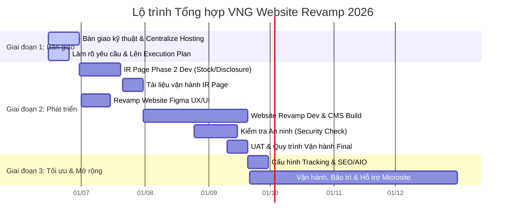

# Báo cáo Tổng hợp & Đối chiếu Dự án VNG Website Revamp

Báo cáo này tổng hợp, chuẩn hóa và đối chiếu chéo thông tin từ ba tài liệu nguồn chính của dự án:
- [web-mng.xlsx (Quản trị & Lộ trình chung)](file:///Users/lap15644/Desktop/HARD/vng/web-mng_details.md)
- [web-tracking.xlsx (Chi tiết Kế hoạch & Ma trận)](file:///Users/lap15644/Desktop/HARD/vng/web-tracking_details.md)
- [website-req.pdf (Đặc tả Yêu cầu Kỹ thuật)](file:///Users/lap15644/Desktop/HARD/vng/website-req_details.md)

---

## 1. Tóm tắt Dự án (Executive Summary)

Dự án **Centralize và Vận hành Hệ thống Website VNG Group** có mục tiêu tối cao là dịch chuyển và revamp Website chính của VNG (`vng.com.vn`) thành nền tảng truyền thông doanh nghiệp tích hợp. 
* **Project Owner**: Corporate Communications (CBC).
* **Đầu mối Kỹ thuật (IT Lead)**: Anh Tú / Anh Đồng.
* **Các Mục tiêu Trọng tâm**:
  1. **Định vị Thương hiệu**: Đưa thông điệp *"Hệ sinh thái số trong kỷ nguyên AI"* vào các trang chủ chốt.
  2. **Tập trung hóa (Centralization)**: Quy hoạch hosting và hạ tầng kỹ thuật về một đầu mối IT quản trị đồng bộ.
  3. **Tự chủ Quản trị (Admin Autonomy)**: Nâng cấp CMS để Content Team tự quản lý trang, bài viết, banner và SEO mà không phụ thuộc vào Dev.
  4. **Tối ưu hóa Tìm kiếm (SEO/AIO Readiness)**: Cấu hình chuẩn SEO kỹ thuật và định dạng dữ liệu có cấu trúc (Schema) để các mô hình AI/LLM dễ dàng đọc hiểu chính xác về VNG.
  5. **Đo lường Hiệu quả (Tracking)**: Thiết lập hệ thống đo lường hành vi người dùng (view, click, download, outbound clicks).

---

## 2. Lộ trình Triển khai Tổng hợp & Đối chiếu Mâu thuẫn

Dưới đây là sơ đồ lộ trình tổng hợp từ các tài liệu bằng Mermaid Gantt:

### Bảng đối chiếu chéo các điểm mâu thuẫn về Timeline:

| Giai đoạn | Mốc trong `web-mng.xlsx` | Mốc trong `web-tracking.xlsx` | Mốc trong `website-req.pdf` | Đánh giá & Khuyến nghị của Antigravity |
| :--- | :--- | :--- | :--- | :--- |
| **Giai đoạn 1: Tiếp nhận & Bàn giao** | **15/06/2026**: Hoàn thành bàn giao kỹ thuật & Centralize. | **17/06 - 24/06/2026**: Bàn giao IR Page và làm rõ trạng thái domain. | **30/06/2026**: Kết thúc bàn giao kỹ thuật và centralize. | **Thực tế**: Tài liệu PDF có thời gian giãn hơn (đến 30/06). Khuyến nghị lấy mốc **24/06** của file tracking làm cột mốc hoàn thành bàn giao thực tế để tránh ảnh hưởng phase sau. |
| **Giai đoạn 2: Thiết kế Figma** | **10/07/2026**: Hoàn thành nội dung & design. | **01/07 - 15/07/2026**: Thiết kế Figma approved bởi ThaoTXN. | **01/07 - 20/09/2026** (Gộp chung cả Dev). | Khuyến nghị chốt thiết kế Figma vào **15/07** để Dev có đủ thời gian code. |
| **Giai đoạn 2: Dev & CMS Build** | **10/08/2026**: Hoàn thành Dev tích hợp tracking, SEO, AI search, admin tool. | **30/06 - 20/07**: Dev IR Page. **31/7 - 20/09**: Code revamp web theo Figma & build CMS. | **01/07 - 20/09/2026** (Gộp chung). | **Mâu thuẫn lớn**: File quản trị `web-mng` yêu cầu xong Dev vào `10/08`, nhưng kế hoạch chi tiết `web-tracking` lại kéo dài code revamp đến **20/09**. Kế hoạch `web-tracking` thực tế hơn vì tính đến thời gian Figma approved (15/07). |
| **Kiểm tra an ninh (Security)** | **25/08/2026** | **Chưa xác định cụ thể** (Trạng thái: Chưa làm) | **Nằm trong Giai đoạn 2** (Trước 20/09) | Nếu Dev kéo dài đến 20/09 thì mốc Security check 25/08 ở `web-mng` là bất khả thi. Khuyến nghị dời lịch Security check sang **25/08 - 10/09** (kiểm thử song song) hoặc thực hiện ngay sau khi xong code (từ **10/09 - 15/09**). |
| **Đo lường (Tracking)** | Gộp trong mốc Dev (**10/08/2026**) | **20/09 - 30/09/2026**: Triển khai tracking cho sitemap. | Nằm trong Giai đoạn 3 (Sau **21/09/2026**) | Cài đặt tracking cơ bản cần hoàn thành trước launch (20/09), tối ưu nâng cao thực hiện trong Phase 3 (đến 30/09). |

---

## 3. Kiến trúc Sitemap mới & Phân loại Nội dung

Dưới đây là cấu trúc Sitemap mới của website VNG:

```mermaid
graph TD
    Home[Trang chủ /] --> About[Về VNG /ve-vng/]
    Home --> Pillars[Trụ cột kinh doanh /tru-cot-kinh-doanh/]
    Home --> People[Con người /con-nguoi/]
    Home --> IR[Nhà đầu tư /ir/]
    Home --> Impact[Tác động /tac-dong/]
    Home --> News[Tin tức /tin-tuc/]
    Home --> Contact[Liên hệ /contact-us/]
    
    %% Về VNG Subs
    About --> Vision[Tầm nhìn - Sứ mệnh - Giá trị]
    About --> History[Lịch sử /lich-su/]
    About --> Leadership[Đội ngũ lãnh đạo /doi-ngu-lanh-dao/]
    About --> Culture[Văn hóa doanh nghiệp /van-hoa-doanh-nghiep/]
    About --> Awards[Giải thưởng /giai-thuong/]
    
    %% Trụ cột kinh doanh Subs
    Pillars --> BU1["Zalo / ZaloPay (Nhúng/Link BU)"]
    Pillars --> BU2["VNGGames / GreenNode (Nhúng/Link BU)"]
    Pillars --> BU3["AI-Native (Nhúng/Link BU)"]
    
    %% Con người Subs
    People --> DevTeam[Phát triển đội ngũ]
    People --> Environment[Môi trường làm việc]
    People --> Events[Sự kiện nội bộ]
    People --> Careers["Tuyển dụng (Nhúng link Career Site)"]
    
    %% Tác động Subs
    Impact --> Econ[Đóng góp kinh tế]
    Impact --> Workforce[Nhân lực số]
    Impact --> Infra[Hạ tầng số]
    Impact --> Comm["Cam kết cộng đồng (Nhúng DMF/UpRace)"]
    
    %% Tin tức Subs
    News --> CorpNews[Tin tức Doanh nghiệp]
    News --> Press[Thông cáo báo chí]
    News --> Results["Kết quả kinh doanh (Auto từ IR)"]
    News --> Connect[Kết nối với VNG]
```

### Phân nhóm Kỹ thuật các Trang trong Sitemap:

1. **Nhóm Nâng cấp Toàn diện (Nội dung + UX/UI Mới)**:
   - **Trang chủ (`/`)**: Thiết lập banner quản trị động, auto-pull 3 tin tức mới nhất từ trang Tin tức, tích hợp phần Career và Contact Us.
   - **Về VNG (`/ve-vng/`)**: Xây dựng mới trang Tầm nhìn - Sứ mệnh, Lịch sử (dạng timeline trực quan), Đội ngũ lãnh đạo (grid profiles), Văn hóa doanh nghiệp và Giải thưởng.
   - **Tác động (`/tac-dong/`)**: Phát triển mới các trang Đóng góp kinh tế, Nhân lực số, Hạ tầng số.
   - **Tin tức (`/tin-tuc/`)**: Các trang Tin tức doanh nghiệp, Thông cáo báo chí, Kết nối với VNG.
2. **Nhóm Nhúng Liên kết (Embed / External Links)**:
   - **Trụ cột kinh doanh**: Nhúng/Link tới website của các BU (Zalo, ZaloPay, VNGGames, GreenNode, AI-Native). Không lập trình lại nội dung của BU.
   - **Tuyển dụng**: Nhúng link dẫn sang dự án riêng Career Site (do team Digital Trans quản lý).
   - **Nhà đầu tư**: Nhúng trang IR hiện tại (`ir.vng.com.vn`) vào cấu trúc website mới.
   - **Cam kết cộng đồng**: Nhúng/Link sang website Quỹ DMF và landing page UpRace.
3. **Nhóm Tự động Cập nhật (Auto-update Integration)**:
   - **Kết quả kinh doanh**: Thiết lập cơ chế tự động lấy dữ liệu từ mục kết quả kinh doanh của trang Nhà đầu tư (IR page) để hiển thị trên trang Tin tức, tránh trùng lặp nội dung thủ công.

---

## 4. Ma trận Tính năng CMS & Đánh giá Khoảng cách (Gap Analysis)

Bảng đối chiếu nhu cầu tính năng CMS được đặc tả trong PDF và tình trạng đáp ứng thực tế trong File Tracking Excel:

| Phân nhóm CMS (Theo PDF) | Yêu cầu Kỹ thuật Đạt (Acceptance Criteria) | Độ ưu tiên | Trạng thái Hiện tại (Excel) | Đánh giá Khoảng cách (Gap Analysis) |
| :--- | :--- | :--- | :--- | :--- |
| **Quản lý nội dung** | Soạn thảo WYSIWYG/block builder; Lưu nháp/Autosave; Đặt lịch đăng/ẩn; Trạng thái kiểm duyệt rõ ràng. | **Must-have** | Đã có phần cơ bản nhưng chưa có WYSIWYG, workflow duyệt chưa rõ. | **Cần phát triển bổ sung**: Tích hợp editor WYSIWYG (như CKEditor/TinyMCE) và cấu hình trạng thái phê duyệt nội dung. |
| **Media & tài liệu** | Thư viện tập trung; Phân mục bằng folder/tag; Thay file không đổi URL; Tự động tối ưu dung lượng ảnh; Scan virus file upload. | **Must-have** | **Chưa có** | **Thiếu hụt lớn**: Cần xây dựng toàn bộ mô-đun quản lý media tập trung, cơ chế ghi đè file giữ nguyên link và tích hợp thư viện nén ảnh tự động. |
| **Workflow xuất bản** | Phân quyền Editor tạo -> Approver duyệt -> Publisher đăng; Ghi nhận lịch sử duyệt kèm bình luận. | **Must-have** | **Chưa có** | **Thiếu hụt**: Cần lập trình cơ chế chuyển đổi trạng thái bài viết và gửi thông báo email/webhook tới người duyệt. |
| **Version & rollback** | Lưu lịch sử phiên bản (người sửa, thời gian, lý do); Cho phép khôi phục phiên bản cũ mà không mất lịch sử. | **Must-have** | **Chưa có** | **Thiếu hụt**: Cần thiết kế database lưu trữ các phiên bản khác nhau của bài viết (audit trail) và giao diện so sánh/rollback. |
| **User & phân quyền** | Quản lý vai trò (Master Admin, Admin, Editor, Contributor, Viewer); Sẵn sàng cho cấu hình multi-site. | **Must-have** | **Chưa có** | **Thiếu hụt**: Cần xây dựng bảng phân quyền chi tiết (RBAC) và thiết kế cấu trúc DB linh hoạt cho multi-site sau năm 2027. |
| **Audit & compliance** | Hệ thống lưu log (tạo/sửa/xóa/duyệt); Log không thể bị xóa bởi user thường; Hỗ trợ bộ lọc và xuất file audit. | **Must-have** | **Chưa có** | **Thiếu hụt**: Cần xây dựng mô-đun ghi log tự động (System Audit Log) và cơ chế xóa tạm (Soft Delete - Trash). |
| **SEO & marketing** | Chỉnh SEO Title, Meta Description, Slug, OG Image, Canonical, Schema; Tự động sinh XML Sitemap; Redirect 301. | **Must-have** | **Chưa có** | **Thiếu hụt**: Cần phát triển các trường nhập liệu SEO metadata vào các trang bài viết, tự cập nhật `sitemap.xml` động và bảng quản lý redirect 301. |
| **Đa ngôn ngữ & menu** | Hỗ trợ VI/EN độc lập; Liên kết bản dịch VI/EN; Quản lý header/footer menu đa cấp; Preview menu. | **Must-have** | **Đã có** (Phần dịch thuật) **Chưa có** (Quản trị Menu) | **Cần phát triển thêm**: Xây dựng mô-đun quản lý menu kéo thả trực quan kèm cảnh báo link lỗi/gãy. |
| **Bảo mật & vận hành** | Đăng nhập an toàn (SSO/MFA); Chống XSS/CSRF/SQL Injection; API có auth/rate limit; Staging/Production environment. | **Must-have** | Cần check lại hệ thống. | **Cần rà soát**: Đánh giá khả năng tích hợp SSO của VNG và cài đặt các middleware bảo mật cho API. |
| **Usability & Integration** | Dashboard hiển thị nội dung chờ duyệt; Cảnh báo rời trang khi chưa lưu; API cho frontend; Webhook clear cache. | **Must-have** | Mới có dashboard chung. | **Cần nâng cấp**: Thiết kế lại trang dashboard quản trị theo các đầu việc cần xử lý và viết API endpoints cho Frontend tiêu thụ dữ liệu. |

---

## 5. Đầu việc Kỹ thuật SEO & AIO cho Nhà phát triển

Để đạt mục tiêu **SEO chuẩn hóa** và **AIO Readiness** (giúp AI/LLM dễ dàng thu thập và hiểu đúng dữ liệu của VNG), đội ngũ Dev cần thực hiện các hạng mục sau:

| Hạng mục SEO/AIO | Mô tả công việc Dev | Tiêu chí Nghiệm thu (Acceptance Criteria) | Phase mục tiêu |
| :--- | :--- | :--- | :--- |
| **Noindex/indexation** | Gỡ bỏ thẻ `x-robots-tag: noindex` bị gán sai; cấu hình file `robots.txt` chuẩn. | Các trang quan trọng cần index không bị Google/AI bots chặn. | Foundation (Giai đoạn 2) |
| **Domain canonical** | Cài đặt redirect 301 để chuẩn hóa tên miền giữa bản `www` và `non-www`. | Chỉ tồn tại một phiên bản tên miền chuẩn, tránh trùng lặp content. | Foundation (Giai đoạn 2) |
| **404 cleanup** | Thiết lập bảng map chuyển hướng (301 redirect) cho 297 URL lỗi 404 hiện tại. | Không còn URL 404 quan trọng; redirect 301 đúng đích. | Foundation (Giai đoạn 2) |
| **Hreflang / Language** | Gắn thẻ `lang="vi"` hoặc `lang="en"` và thẻ `hreflang` tương ứng cho từng trang dịch thuật. | Các công cụ tìm kiếm không bị nhận diện nhầm ngôn ngữ bản dịch. | Build (Giai đoạn 2) |
| **Organization Schema** | Inject đoạn code dữ liệu cấu trúc `JSON-LD` loại `Organization` trên trang chủ. | Vượt qua bài kiểm tra Rich Results Test; AI nhận diện đúng định danh VNG. | Build (Giai đoạn 2) |
| **Breadcrumb Schema** | Tự động sinh danh sách breadcrumb dạng `JSON-LD BreadcrumbList` theo URL path. | Hiển thị đúng phân cấp thư mục trang trên kết quả tìm kiếm Google. | Build (Giai đoạn 2) |
| **FAQ Schema** | Thiết lập cấu trúc FAQ dạng Accordion và tự động map sang schema `FAQPage`. | Rich results hiển thị câu hỏi thường gặp trực tiếp trên Google Search. | Build (Giai đoạn 2) |
| **NewsArticle / Report Schema** | Tự động chèn metadata (headline, datePublished, author, publisher) trên các trang tin tức/báo cáo. | Các bài viết tin tức đạt chuẩn định dạng Google News. | Build (Giai đoạn 2) |
| **XML Sitemap** | Lập trình tính năng tự cập nhật file `sitemap.xml` mỗi khi bài viết/trang mới được publish. | Sitemap luôn cập nhật, chỉ chứa các URL canonical hợp lệ. | Build/UAT (Giai đoạn 2) |
| **Core Web Vitals** | Tối ưu hóa dung lượng ảnh (nén WebP), trì hoãn load script không thiết yếu, thiết lập cache. | Điểm hiệu năng CWV đạt ngưỡng xanh (LCP < 2.5s, INP < 200ms). | UAT (Giai đoạn 2) |

---

## 6. Ma trận Phân công Vai trò & Phối hợp (RACI Matrix)

* **R (Responsible)**: Đơn vị trực tiếp thực hiện công việc.
* **A (Accountable)**: Đơn vị chịu trách nhiệm tối cao về kết quả và phê duyệt.
* **C (Consulted)**: Đơn vị tư vấn, đóng góp ý kiến chuyên môn.
* **I (Informed)**: Đơn vị được thông báo khi công việc hoàn thành.

| Hạng mục Công việc | CC/CBC (Communications) | BIE (Design Team) | IT Team (Phát triển) | VNGGames / A4B / Digital Trans |
| :--- | :---: | :---: | :---: | :---: |
| **Bàn giao source code & hạ tầng** | C | I | **R** | **A** |
| **Thiết kế Figma UX/UI mới** | **A** | **R** | C | I |
| **Viết & Duyệt nội dung mới** | **A** | I | I | I |
| **Lập trình Website & CMS Revamp** | C | C | **R / A** | I |
| **Phát triển IR Page Phase 2 (Stock API)** | I | C | **R / A** | C (Hỗ trợ bàn giao Phase 1) |
| **Cấu hình SEO kỹ thuật & AIO** | C | I | **R / A** | I |
| **Cài đặt hệ thống Đo lường (Tracking)** | **A** | I | **R** | I |
| **Kiểm tra An toàn Bảo mật (Security)** | I | I | **R** | C (VRC kiểm tra) |
| **Kiểm thử nghiệm thu (UAT)** | **A** | C | **R** | I |
| **Vận hành & Hướng dẫn sử dụng** | **R / A** | I | **R** | I |
